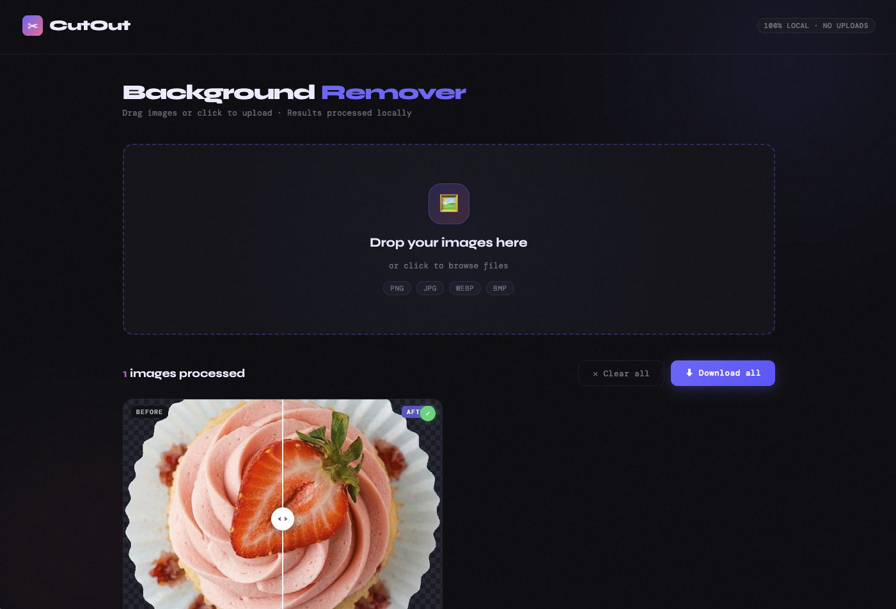

# CutOut
## [Try it online](https://0shuvo0.github.io/CutOut/)
Simple browser-based background remover.

This project removes image backgrounds locally in the browser using BiRefNet via Transformers.js and ONNX Runtime Web. Images are processed on your device and are not uploaded to a server.

## Features

- Remove backgrounds from images in the browser
- Supports multiple image uploads
- Drag and drop or click to select files
- Download processed images as PNG
- Local processing after the model is loaded

## Files

- `index.html` - app structure
- `style.css` - app styling
- `main.js` - model loading, image processing, and UI logic

## How to run

1. Open `index.html` in a modern browser.
2. Wait for the model to download on first load.
3. Upload or drag in one or more images.
4. Download the processed result.

## Notes

- First run downloads the RMBG-1.4 model, which is about 40 MB.
- Chrome or Edge is the safest option for compatibility.
- The app may fail in sandboxed environments or embedded viewers.
- If the browser blocks required features, run it from a simple local server instead of an embedded preview.

## Tech

- HTML
- CSS
- JavaScript
- Transformers.js
- ONNX Runtime Web